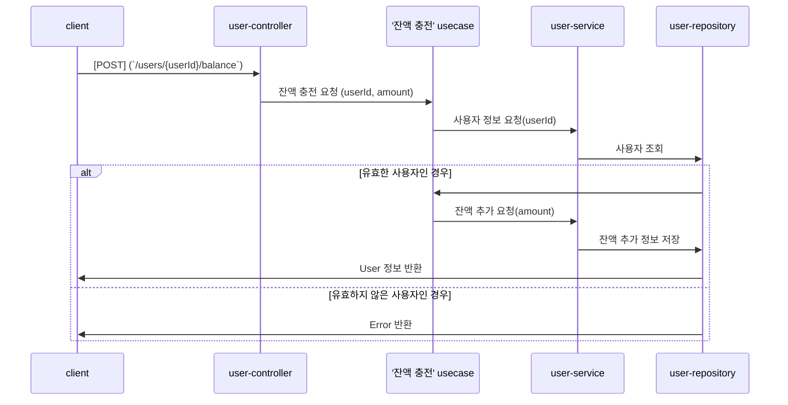
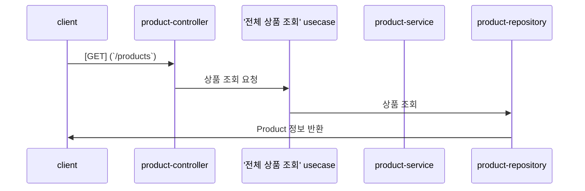
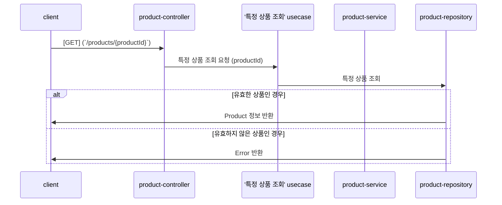
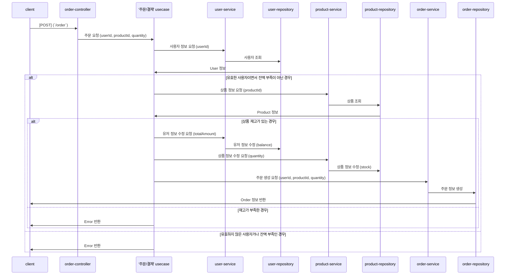
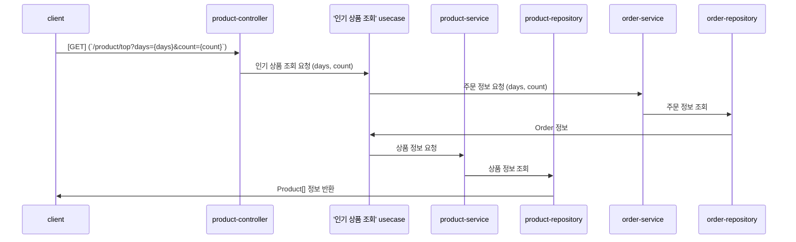

# 이커머스 상품 주문 서비스

- `e-커머스 상품 주문 서비스`를 구현해 봅니다.
- 상품 주문에 필요한 메뉴 정보들을 구성하고 `조회`가 가능해야 합니다.
- 사용자는 `상품을 여러개 선택해 주문`할 수 있고, `미리 충전한 잔액을 이용`합니다.
- 상품 주문 내역을 통해 `판매량이 가장 높은 상품을 추천`합니다.

## 요구사항 및 제약사항

- 아래 API 를 구현합니다.
  - 잔액 충전 / 조회 API
  - 상품 조회 API
  - 주문 / 결제 API
  - 인기 판매 상품 조회 API
  - 장바구니에 상품 추가/삭제 (심화)
  - 장바구니 조회 (심화)
- `각 기능 및 제약사항`에 대해 `단위 테스트를 반드시 하나 이상 작성`하도록 합니다.
- `다수의 인스턴스로 어플리케이션이 동작`하더라도 기능에 문제가 없도록 작성하도록 합니다.
- `동시성 이슈를 고려`하여 구현합니다.
- `재고 관리`에 문제 없도록 구현합니다.
- 사용자는 `구매 이전에` 관심 있는 `상품들을 장바구니에 적재`할 수 있습니다.

## 마일스톤

<details>
  <summary>&nbsp;&nbsp;&nbsp;&nbsp;<strong>Week-1</strong></summary>
  <br>
  <ul>
    <li>- [X] 마일스톤 제작</li>
    <li>- [X] 시나리오 요구사항 분석</li>
    <li>- [X] ERD 설계</li>
    <li>- [X] API 명세서 작성</li>
    <li>- [X] 시퀀스 다이어그램 작성</li>
    <li>- [ ] 도메인 모델 작성 </li>
    <li>- [ ] Mock API 구현</li>
    <li>- [ ] 서버 초기 설정</li>
  </ul>
</details>

<details>
  <summary>&nbsp;&nbsp;&nbsp;&nbsp;<strong>Week-2</strong></summary>
  <br>
  <ul>
    <li>[ ] 아키텍처 설계</li>
    <li>[ ] API 구현 (기본)</li>
    <li>[ ] 단위 테스트, 통합 테스트 </li>
    <li>[ ] 동시성 테스트 </li>
  </ul>
</details>

<details>
  <summary>&nbsp;&nbsp;&nbsp;&nbsp;<strong>Week-3</strong></summary>
  <br>
  <ul>    
    <li>[ ] API 구현 (심화)</li>
    <li>[ ] 단위 테스트, 통합 테스트 </li>
    <li>[ ] 동시성 테스트 </li>
  </ul>
</details>
</div>

## 시나리오 및 시퀀스 다이어그램

<details>
  <summary>&nbsp;&nbsp;&nbsp;&nbsp;<strong>💰 잔액 조회 (User)</strong></summary>
  <br>
  
  ```mermaid
  sequenceDiagram 
    participant client as client
    participant A as user-controller
    participant B as '잔액 조회' usecase
    participant C as user-service
    participant D as user-repository
    client ->> A: [GET] (`/users/{userId}/balance`)
    A ->> B: 잔액 조회 요청 (userId)
    B ->> C: 사용자 정보 요청(userId)
    C ->> D: 사용자 조회
    alt 유효한 사용자인 경우
      D ->> client: User 정보 반환
    else 유효하지 않은 사용자인 경우
      D ->> client: Error 반환
    end
  ```
  
</details>

<details>
  <summary>&nbsp;&nbsp;&nbsp;&nbsp;<strong>💰 잔액 충전 (User)</strong></summary>
  <br>


  
</details>

<details>
  <summary>&nbsp;&nbsp;&nbsp;&nbsp;<strong>🔎 전체 상품 조회 (Product)</strong></summary>
  <br>


  
</details>

<details>
  <summary>&nbsp;&nbsp;&nbsp;&nbsp;<strong>🔎 특정 상품 조회 (Product)</strong></summary>
  <br>


  
</details>

<details>
  <summary>&nbsp;&nbsp;&nbsp;&nbsp;<strong>🚛 주문/결제 (Order)</strong></summary>
  <br>


  
</details>

<details>
  <summary>&nbsp;&nbsp;&nbsp;&nbsp;<strong>🔎 인기 상품 조회 (Product)</strong></summary>
  <br>


  
</details>


## API 명세


## 도메인 모델

tbd

## ERD


